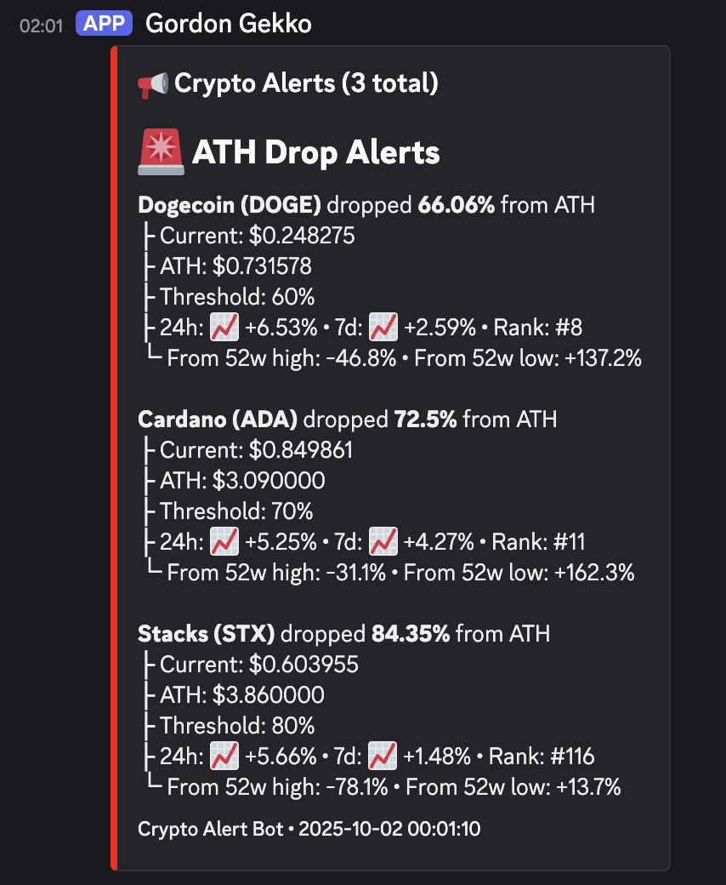

# 🔍 CoinWatch

Cryptocurrency price monitoring system that sends intelligent alerts to Discord.


## Screenshot



## Features

- **ATH Drop Alerts** - Get notified when crypto drops X% from all-time high
- **Price Alerts** - Set custom price thresholds
- **Market Insights** - 24h/7d changes, market cap rank, 52w high/low distance
- **Smart Retry Logic** - Handles API rate limits automatically
- **Multi-Coin Support** - Monitor 12+ cryptocurrencies
- **Fully Tested** - 39 tests ensuring reliability

## Quick Start

```bash
# Clone and setup
git clone https://github.com/sharpz33/coinwatch.git
cd coinwatch
python3 -m venv venv
source venv/bin/activate
pip install -r requirements.txt

# Configure
cp .env.example .env
# Edit .env with your Discord webhook URL

# Initialize and run
python update_52w_stats.py
python crypto_alert.py

# Setup automated scheduling (cron)
./setup_cron.sh
```

## Configuration

**coins_config.json** - Add/edit coins:
```json
{
  "id": "bitcoin",
  "name": "Bitcoin",
  "symbol": "BTC",
  "ath_thresholds": [30, 40, 50, 60, 70],
  "price_alerts": [80000, 70000, 60000]
}
```

**alert_config.json** - Customize alerts:
```json
{
  "reset_alerts_daily": true,
  "check_interval_minutes": 360
}
```

## How It Works

1. **crypto_alert.py** - Checks prices every 6 hours, sends Discord alerts
2. **update_52w_stats.py** - Updates 52-week stats weekly (Sunday 3 AM)
3. **setup_cron.sh** - Configures automated scheduling

## Usage

### Dry Run Mode
Test alerts without sending to Discord or saving state:
```bash
python crypto_alert.py --dry-run
```

### Validate Configuration
Check your config files for errors:
```bash
python crypto_alert.py --validate
```

## Testing

```bash
pytest                          # Run all tests (30 passing)
pytest test_crypto_alert.py -v # Test main script
```

## Monitoring

```bash
tail -f crypto_alert.log     # View alert logs
tail -f update_52w_stats.log # View update logs
crontab -l                    # Check cron schedule
```

## Troubleshooting

- **No alerts?** Check Discord webhook in `.env` and alert thresholds
- **Rate limits?** Script retries automatically, consider less frequent checks
- **Missing 52w data?** Run `python update_52w_stats.py`

## Contributing

1. Fork the repo
2. Add tests for new features
3. Ensure tests pass
4. Submit PR

## License

MIT License - see [LICENSE](LICENSE)

## Acknowledgments

- [CoinGecko API](https://www.coingecko.com/en/api) for price data

---

**Disclaimer**: For informational purposes only. DYOR before investing.
